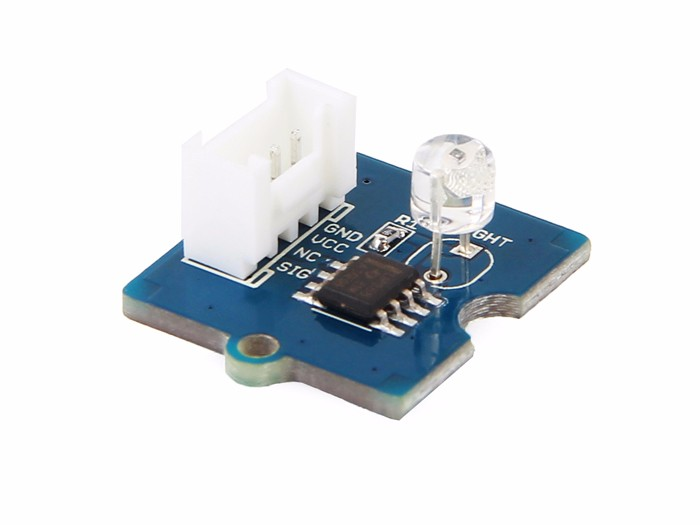

# ตัวอย่าง เซ็นเซอร์แสง

อธิบายว่าเป็นเซ็นเซอร์อะไร ตรวจจับอะไร ตรวจจับยังไง


ค่าของเซ็นเซอร์แสงเป็นการประมาณการค่าความเข้มของแสงเท่านั้น เช่น ค่าน้อยหมายถึงมีความเข้มของแสงน้อย ค่าสูงหมายถึงมีความเข้มของแสงมาก เป็นต้น **ไม่ได้**มีหน่วยเป็น ลักซ์


## คุณสมบัติ

* ให้ค่าเอ้าพุตท์ออกมาเป็นค่าอนาลอก 0-1024
* ความแม่นยำสูงและตรวจขจับได้รวดเร็ว
* มีขนาดกระทัดรัด
* มีช่วงค่าที่กว้าง

## การใช้งาน

### ใช้งานกับโกโกบอร์ด

#### ฮาร์ดแวร์

* เตรียมอุปกรณ์ที่ต้องใช้ 
  * โกโกบอร์ด
  * เซ็นเซอร์แสง
  * สายต่อ Grove
* นำสาย Grove ต่อเข้ากับเซ็นเซอร์
* นำอีกด้านของสายต่อเข้ากับพอร์ทเซ็นเซอร์บนโกโกบอร์ด เช่น พอร์ทเซ็นเซอร์ 1

#### ซอฟต์แวร์

* สังเกตการเปลี่ยนค่าเซ็นเซอร์บนโปรแกรม GoGo Code
* เขียนโปรแกรมอ่านค่าเซ็นเซอร์แสง โดย
  * เมื่อมีค่าน้อยกว่า 400 ให้**ปิด**พอร์ท A
  * เมื่อมีค่ามากกว่า 800 ให้**เปิด**พอร์ท A



`to main  
  forever  
  [  
    if ( sensor1 < 400 ) [ a, on ]  
    if ( sensor1 > 800 ) [ a, off ]  
  ]  
end`



[https://code.gogoboard.org/\#/app/program/73eded72-02de-4c13-b3dd-af6dbb0bddee](https://code.gogoboard.org/#/app/program/73eded72-02de-4c13-b3dd-af6dbb0bddee)



### ใช้งานกับ GoGo Bright

#### ฮาร์ดแวร์

* เตรียมอุปกรณ์ที่ต้องใช้ 

#### ซอฟต์แวร์

* เตรียมอุปกรณ์ที่ต้องใช้

## แหล่งอ้างอิง

* \[SEED wiki\] [Grove - Light Sensor ](http://wiki.seeedstudio.com/Grove-Light_Sensor/)
* \[Datasheet\] [LM358.PDF](https://github.com/SeeedDocument/Grove_Light_Sensor/raw/master/res/LM358.pdf)

